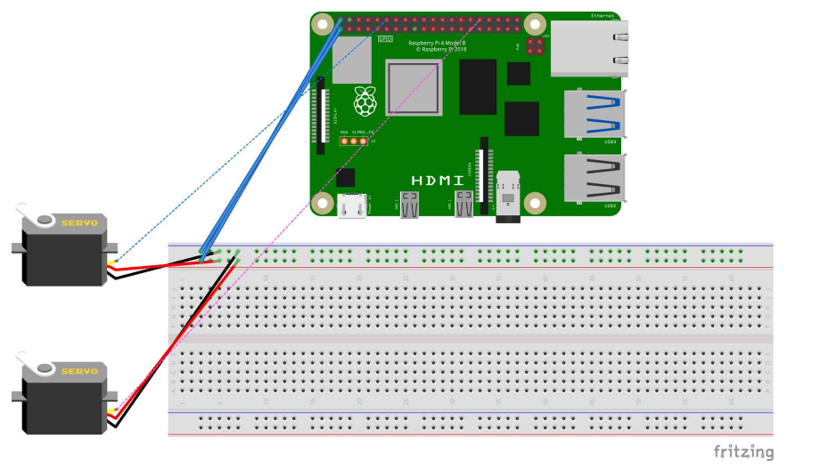

# 🚨EL-SA
EL:SA(ELevator Safety Assistant) 교통 약자 인식 엘리베이터 자동 도어 시스템

## 📌 문제 정의 (AS-IS)
- 일반 엘리베이터의 문 열림 시간은 평균 3~4초로 교통약자에게 위험 🚨
- (관련기사: https://m.mbn.co.kr/news/society/3943801)

- 교통약자 우선 엘리베이터의 경우 문 열림 시간이 20~30초로 일반 사용자에게는 비효율적으로 긴 시간이 소요 📉
-  (관련기사: https://www.socialfocus.co.kr/news/articleView.html?idxno=8699)
  
## 📌 프로젝트 예상 결과 (TO-BE)
- 안전과 효율성 두 마리 토끼를 모두 놓치고 있는 현재의 엘리베이터를 개선하는 것이 목표
  -- 일반 엘리베이터를 이용하는 교통약자에게 문 열림을 길게
  -- 교통약자 우선 엘리베이터를 이용하는 일반인에게는 문 열림을 짧게

## 📌 개발 요구사항
- 시스템이 교통약자를 인식할 수 있어야 한다.
- 엘리베이터 문 열림 시간을 동적으로 조절 할 수 있어야 한다.
- 시연을 위하여 라즈베리파이를 활용하여 시제품을 제작한다.

## 📌 사용 기술 및 개발환경
### 비전 AI 모델 개발환경
 
 

### 시제품, 교통약자 객체 트래커 개발환경

## 📌 EL-SA 프로젝트 최종 PPT
.pdf)

## 📌 시제품 구조도

## 📌 Yolov8 모델 다이어그램

## 📌 EL-SA 클래스 다이어그램

## 📌 문 열림 시간 조절 알고리즘 순서도

